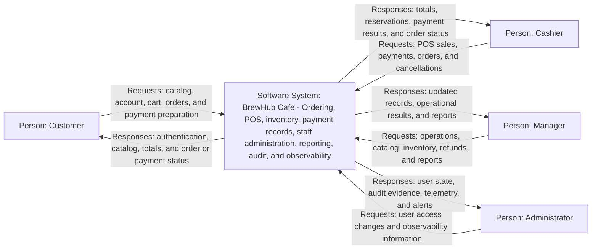

# BrewHub Cafe - System Context Diagram Specification

## 1. Purpose

This document contains the information needed to create BrewHub Cafe's System Context Diagram (C4 Level 1).

The diagram should answer four questions:

1. Who uses BrewHub Cafe?
2. What does BrewHub Cafe do for each user?
3. Which external software systems does BrewHub Cafe communicate with?
4. What is inside or outside the BrewHub system boundary?

This is a system-level view. It must not show pages, API endpoints, domain services, database tables, or individual Nuxt modules. Those details belong in component, container, sequence, and ER diagrams.

## 2. Diagram Scope and Viewpoint

**System of interest:** BrewHub Cafe System

**Viewpoint:** People and external systems that exchange information with BrewHub Cafe.

**Current deployment:** One cafe branch using one web application and one relational database.

**Growth target:** Up to 20 branches and approximately 20,000 orders per day, with possible delivery, loyalty, supplier purchasing, accounting, and online-ordering capabilities.

The primary submission diagram should describe the current implemented system. Planned integrations should be shown in a separate future-state diagram or clearly marked as planned. They must not be presented as live integrations.

## 3. Central System

### BrewHub Cafe System

**Type:** Software system

**Short diagram description:**

> A web-based cafe ordering, point-of-sale, inventory, payment-recording, staff-administration, reporting, audit, and observability system for BrewHub Cafe.

**Responsibilities:**

- publish the product catalog and categories;
- register and authenticate users;
- maintain customer accounts and profiles;
- manage customer carts and orders;
- support cashier point-of-sale orders;
- calculate authoritative prices and order totals on the server;
- reserve, release, receive, and adjust inventory;
- record payments, payment outcomes, and refunds;
- prevent duplicate checkout and payment processing through idempotency controls;
- provide staff order views and management reports;
- administer staff accounts, roles, and access status;
- record sensitive actions in an audit trail;
- collect operational logs, metrics, traces, and alerts;
- recover expired pending orders and inventory reservations.

The browser interface, Nuxt server, scheduled recovery task, PostgreSQL database, and all business domains are parts of this system. They are not external systems on the context diagram.

## 4. Current Actors and Relationships

| Person | Description | Relationship to BrewHub Cafe | Information sent to the system | Information received from the system |
|---|---|---|---|---|
| Customer | A public or registered cafe customer using the customer-facing web experience. | Browses the catalog, registers or signs in, maintains an account, builds a cart, creates orders, prepares payment, views order history, and cancels an eligible own order. | Search/filter criteria, registration or login data, profile data, cart items, order request, payment-preparation request, cancellation request. | Authentication result, catalog data, authoritative prices and totals, order status, payment state, order history, validation/errors. |
| Cashier | A staff member serving walk-in customers. | Uses the POS, creates walk-in orders, prepares/completes permitted payments, checks orders, and views permitted catalog/inventory information. | Credentials, POS line items, payment details, order actions, search/filter criteria. | Product availability, calculated totals, reservation/payment result, order status, permitted inventory/order data. |
| Manager | A staff member responsible for branch operations. | Performs cashier functions and manages catalog, inventory, order cancellation/refunds, and operational reporting where authorized. | Catalog changes, price changes, stock receipts/adjustments, refund/cancellation requests, report criteria. | Inventory levels and movements, order/payment status, reports, alerts, operation results. |
| Administrator | A privileged staff member responsible for access and oversight. | Manages staff accounts, roles/access status, staff profile corrections, dashboards, and observability information. | User/account changes, role/status changes, profile corrections, observability filters. | User/account state, dashboards, audit/operational evidence, telemetry, alerts, request logs. |

### Role inheritance shown in text, not as extra diagram arrows

- Managers normally perform operational capabilities in addition to management capabilities.
- Administrators are responsible for account administration and oversight.
- The exact permission matrix must be represented by authorization documentation or a role matrix, not by adding internal permission details to the context diagram.

## 5. Common Request and Response Process

All four actors use the same general interaction pattern even though the business operation and authorization rules differ.

| Step | Request processing | Response processing |
|---:|---|---|
| 1 | The actor selects an action in the web interface. | The interface waits for the operation result and prevents accidental duplicate submission where appropriate. |
| 2 | The browser sends an HTTPS request containing the route, method, query parameters or JSON body, and the session cookie when authenticated. State-changing requests may also carry CSRF and idempotency information. | The server returns an HTTP status and a structured JSON result. |
| 3 | BrewHub creates request and trace context for operational correlation. | Logs and telemetry can associate the result with the request, trace, user, branch, and order when those identifiers are available. |
| 4 | BrewHub authenticates the session when the operation is protected. | Missing or expired authentication returns an unauthorized response and the interface sends the actor to sign in. |
| 5 | BrewHub checks the actor's role, permission, resource ownership, and applicable branch scope. | A disallowed operation returns a forbidden response without exposing protected data. |
| 6 | BrewHub validates identifiers, query values, and request-body fields. | Invalid input returns field or request validation errors that the interface can display. |
| 7 | The appropriate business workflow reads or changes data, using transactions, concurrency control, and idempotency where required. | Success returns the requested data or the newly calculated resource state; a business conflict returns a conflict response. |
| 8 | Sensitive changes create audit evidence and important operations emit logs, metrics, and trace events. | The response may include a confirmation message, updated resource, pagination metadata, or trace identifier, depending on the endpoint. |
| 9 | The interface updates the screen using server-authoritative data. | The actor sees the result, current status, totals, or a safe actionable error message. |

### Common logical flow

```text
Actor
  -> BrewHub web interface
  -> HTTPS request
  -> Authentication and authorization
  -> Input validation
  -> Business workflow and database transaction
  -> Audit and operational telemetry
  -> HTTP/JSON response
  -> Updated interface
  -> Actor
```

### Common response categories

| Response category | Meaning shown to the actor |
|---|---|
| Success (`200`, `201`, or `202`) | Requested data, a created or updated resource, a confirmation message, or a processing/verification state. |
| Invalid request (`400`) | One or more fields, identifiers, filters, or request values are invalid. |
| Unauthenticated (`401`) | The actor must sign in again. |
| Forbidden (`403`) | The signed-in actor does not have the required role, permission, ownership, or branch access. |
| Not found (`404`) | The requested resource does not exist or is intentionally hidden from that actor. |
| Conflict (`409`) | Current business state or version prevents the requested action, such as an invalid order state or concurrent update. |
| Server/service failure (`5xx`) | The operation could not be completed; BrewHub returns a safe error while retaining request/trace evidence for investigation. |

## 6. Actor-Specific Request and Response Processes

### Customer

| General process | Customer request | BrewHub Cafe response |
|---|---|---|
| Register and authenticate | Submit registration details or username/email and password; request logout when finished. | Create the customer account when valid, establish or clear the session, return the current account identity, or return a safe authentication/validation error. |
| Browse catalog | Request products/categories and submit search, category, sorting, or paging filters. | Return active catalog information, server-held prices, category data, result metadata, or an empty result. |
| Manage cart | Add/remove products and change quantities in the browser before checkout. | Present recalculated client-side cart display; final price and availability remain subject to server validation during ordering. |
| Create order | Submit selected product IDs and quantities. | Validate customer ownership and products, recalculate totals, create the order, reserve inventory as required, and return the order or a stock/business conflict. |
| Prepare payment | Request payment preparation for an eligible own order. | Validate ownership and order state, return the authoritative amount and payment-ready order state, or return a conflict/error. |
| Simulate payment in development | Submit a development-only payment outcome request. | Record/return the simulated result and updated order/payment state. No production payment gateway is currently connected. |
| View orders | Request the signed-in customer's order list or a specific owned order. | Return only that customer's order summary/detail and payment information, or a safe not-found/forbidden response. |
| Cancel order | Submit an order ID and cancellation reason for an eligible own order. | Cancel according to order rules, release applicable reservation state, return the updated order, or explain why cancellation is not allowed. |
| View account dashboard/profile | Request the current customer identity and dashboard aggregates. | Return the active customer profile and customer-scoped activity summary. |

### Cashier

| General process | Cashier request | BrewHub Cafe response |
|---|---|---|
| Authenticate and open workspace | Submit staff credentials and request the cashier dashboard or own profile. | Establish the staff session, confirm the Cashier role, and return cashier-scoped dashboard/profile information. |
| Browse POS catalog | Search/filter available products and categories while composing a sale. | Return product/category data and displayed prices for POS selection. |
| Create POS order | Submit walk-in line items. | Revalidate items and prices, calculate authoritative totals, create the POS order, and return its initial state. |
| Prepare POS payment | Request stock reservation and payment preparation for the created order. | Reserve available stock, return the payable amount and pending-payment state, or return an inventory/business conflict. |
| Complete permitted payment | Submit method, amount, and provider/reference data where applicable. | Check payment/provider-reference rules, record the outcome, complete the order on success, or return failed/unknown verification state. POS payment idempotency wrapping is not yet implemented. |
| View staff orders | Request recent orders or a selected order's details. | Return the permitted order list/details, items, payment state, and reservation information. |
| Cancel staff order | Submit an eligible order ID and cancellation reason. | Cancel the order and release applicable reservations, write operational/audit evidence, or return a state conflict. |
| View permitted operational data | Request cashier dashboard figures, profile, and read-only operational information exposed to the role. | Return cashier-scoped aggregates and permitted data without management-only mutations. |

### Manager

| General process | Manager request | BrewHub Cafe response |
|---|---|---|
| Authenticate and open workspace | Submit credentials and request the manager dashboard or own staff profile. | Establish the session, confirm the Manager role, and return manager dashboard/profile data. |
| Perform POS and order operations | Submit the same POS, payment, order-view, and cancellation requests available in the shared staff workflow. | Return authoritative catalog, order, inventory-reservation, payment, and cancellation outcomes. |
| Manage products | Request product lists/details; submit new products or validated product/price/status changes. | Return management catalog data; create/update the product; reject invalid, duplicate, stale, or unauthorized changes; audit sensitive changes. |
| Manage categories | Request category data or submit a new category. | Return current categories or the created category, including validation/conflict errors where applicable. |
| View inventory | Request branch inventory and stock-movement history using supported filters. | Return stock balances and movement records for the requested permitted scope. |
| Receive or adjust stock | Submit branch, product, quantity/delta, reference, and reason. | Apply the concurrency-safe stock operation, create a movement/audit trail, and return the resulting stock state or validation/conflict error. |
| Refund completed order | Submit an eligible completed order and required refund reason. | Validate order/payment state, record the refund, return refund details, or reject an ineligible/duplicate refund. |
| View management reports | Submit a supported reporting request/period. | Return read-only branch sales, order, payment/refund, and inventory-oriented summary data. |

### Administrator

| General process | Administrator request | BrewHub Cafe response |
|---|---|---|
| Authenticate and open workspace | Submit credentials and request the administrator dashboard. | Establish the session, confirm the Admin role, and return administrator-scoped account statistics. |
| List and create staff users | Request user records or submit a new validated staff account. | Return safe account information or create the account with permitted role/access values; never return password hashes. |
| Manage user access | Submit a target user, role/status change, version data, and required reason where applicable. | Apply the authorized change, detect stale/conflicting changes, return updated safe user data, and create an audit record. |
| View/correct staff profile | Request a manager/cashier profile or submit permitted name/contact corrections with a reason. | Return the safe profile or atomically update allowed fields with before/after audit evidence. |
| View observability | Request request logs, application/database/security/performance telemetry, and alerts using supported filters. | Return operational summaries, traces/log information, thresholds, and alerts without exposing credentials or protected raw internals. |
| Review system status | Request dashboard or permitted health/oversight information. | Return account/operational status appropriate to administrator oversight. |

### Implementation evidence used for these processes

| Area | Primary project files |
|---|---|
| Shared authentication/session flow | `web/server/api/auth/`, `web/app/middleware/auth.ts`, and `web/server/domains/authentication/` |
| Customer catalog, cart, account, and orders | `web/app/pages/index.vue`, `web/app/pages/cart.vue`, `web/app/pages/account/`, `web/server/api/catalog/`, and `web/server/api/customer/` |
| Cashier dashboard, POS, profile, and shared orders | `web/app/pages/staff/cashier/`, `web/app/pages/staff/pos/`, `web/app/pages/staff/orders/`, `web/app/pages/staff/profile.vue`, and `web/server/api/staff/` |
| Manager catalog, inventory, refunds, and reports | `web/app/pages/staff/catalog/`, `web/app/pages/staff/inventory.vue`, `web/app/pages/staff/manager/`, `web/server/api/manager/`, and the shared staff POS/order APIs |
| Administrator users and observability | `web/app/pages/admin/`, `web/server/api/admin/`, and `web/server/api/observability/` |
| Request context, audit, telemetry, and domain processing | `web/server/middleware/request-context.ts`, `web/server/domains/observability/`, and the domain service/repository folders under `web/server/domains/` |

## 7. Current External Software Systems

No production third-party integration is implemented in the current repository.

In particular:

- there is no live card, bank, or e-wallet payment gateway integration;
- there is no email or SMS delivery service;
- there is no external identity provider;
- there is no delivery marketplace integration;
- there is no external accounting or supplier system integration;
- there is no third-party monitoring platform integration.

Payment provider names and references can be recorded by the Payment domain, and development endpoints can simulate payment outcomes. A simulated provider is test behavior inside BrewHub, not an external production system. Therefore, a payment gateway must not appear as a current live dependency.

## 8. Current Context Diagram Content

Use the following nodes in the current-state diagram:

| ID | Element | Element type | Diagram label |
|---|---|---|---|
| `customer` | Customer | Person | Browses the catalog and creates, pays for, and tracks personal cafe orders. |
| `cashier` | Cashier | Person | Processes walk-in orders through the POS. |
| `manager` | Manager | Person | Manages branch operations, inventory, catalog, refunds, and reports. |
| `administrator` | Administrator | Person | Manages staff access and monitors system operation. |
| `brewHub` | BrewHub Cafe System | Software system | Provides ordering, POS, inventory, payment records, administration, reporting, audit, and observability. |

Use these request and response relationships:

| Actor | Requests sent to BrewHub Cafe | Responses returned by BrewHub Cafe |
|---|---|---|
| Customer | Catalog search, registration/login, account access, cart/order submission, payment preparation, order lookup, eligible cancellation. | Authentication result, catalog data, authoritative totals, order/payment status, history, confirmation, or safe error. |
| Cashier | Staff login, POS order, payment preparation/completion, recent order lookup, eligible cancellation, profile/dashboard access. | Session/role result, POS catalog, calculated totals, reservation/payment outcome, order data, dashboard/profile, or safe error. |
| Manager | Staff login, shared POS/order actions, product/category changes, inventory receipt/adjustment, refund, report request. | Authorized operational data, updated catalog/stock/order/payment state, refund result, report, audit-aware confirmation, or safe error. |
| Administrator | Staff login, user creation/listing, role/status/profile change, dashboard, telemetry/log/alert request. | Admin session result, safe user/account data, updated access/profile state, dashboard, operational evidence, telemetry/alerts, or safe error. |

All interactions use the BrewHub web interface over HTTPS. The detailed request and response processes in Sections 5 and 6 are supporting notes for these high-level diagram relationships.

## 9. Ready-to-Render Current-State Diagram



## 10. System Boundary

### Inside the BrewHub Cafe boundary

- public/customer website;
- customer account and order experience;
- staff and admin web workspaces;
- POS interface;
- server API;
- Authentication domain;
- Customer domain;
- Catalog domain;
- Ordering domain;
- Inventory domain;
- Payment domain;
- Reporting domain;
- Idempotency support;
- Audit and observability support;
- scheduled expired-order recovery;
- PostgreSQL operational database;
- application-managed session cookies.

### Outside the current boundary

- customers' and staff members' devices and browsers;
- cafe staff as people;
- network/Internet access;
- any future payment processor;
- any future email or SMS provider;
- any future delivery marketplace;
- any future supplier, accounting, or external monitoring platform.

### Elements that should not be drawn on the context diagram

- Vue pages and components;
- Pinia stores;
- API routes;
- middleware;
- domain repositories and services;
- PostgreSQL tables;
- database functions and stored procedures;
- Docker containers;
- Nuxt Security, authentication, and validation libraries;
- individual branches as separate software systems.

These are implementation or container/component details. Their ownership rules are documented separately in [`DOMAIN_BOUNDARIES.md`](./DOMAIN_BOUNDARIES.md).

## 11. Trust Boundaries and Security Notes

These details can appear as diagram notes or in accompanying text:

1. Every browser request crosses an untrusted network boundary and should use HTTPS in production.
2. Authentication uses server-managed sessions stored in secure, HTTP-only cookies.
3. Authorization is enforced on the server; hiding a page or button is not a security boundary.
4. Customers may access only their own profile and orders.
5. Staff actions are limited by role/permission and, in the future multi-branch design, by branch assignment.
6. Sensitive mutations require validation, authorization, CSRF protection where cookie authentication is used, audit records, and structured telemetry.
7. Password hashes, session secrets, database credentials, and raw internal errors must not cross the boundary to a browser.
8. Payment retries and state-changing workflows require idempotency keys to prevent duplicate effects.

## 12. Important Data Crossing the Boundary

| Data category | Examples | Main actors | Protection expectation |
|---|---|---|---|
| Authentication data | Username/email and password, session cookie. | Customer, Cashier, Manager, Administrator. | HTTPS, secure password hashing, HTTP-only cookies, rate limiting, no credential logging. |
| Customer personal data | Name, email, account/profile identifiers. | Customer, Administrator where authorized. | Least privilege, ownership checks, audit of sensitive corrections, retention rules. |
| Order data | Items, quantities, totals, status, order identifiers. | Customer and staff. | Server-authoritative pricing, ownership/role checks, branch scope, traceability. |
| Payment data | Method, amount, result, provider reference, refund information. | Customer and authorized staff. | Idempotency, no sensitive card storage, audit, reconciliation of unknown outcomes. |
| Inventory data | Available/reserved quantities, receipts, adjustments, movement reasons. | Cashier and Manager according to permission. | Concurrency control, branch scope, auditable stock movements. |
| Administrative data | Roles, status, user profiles, correction reasons. | Administrator. | Strong authorization, validation, audit before/after values. |
| Operational telemetry | Request, trace, user, branch, and order identifiers; durations and failures. | Administrator/operations. | Avoid secrets and excessive personal data; restrict access and define retention. |

## 13. Quality and Scale Annotations

These values normally belong beside the context diagram or in its supporting narrative rather than inside every node:

| Concern | Current/target value |
|---|---:|
| Initial branches | 1 |
| Growth branches | Up to 20 |
| Staff accounts | About 30 |
| Concurrent users | About 10 initially |
| Products | Up to 5,000 |
| Customers | Up to 50,000 |
| Orders per day | About 1,000 initially; about 20,000 in the growth scenario |
| Average items per order | 4 |
| Stock movements per day | Up to 10,000 initially |
| Availability target | 99.5% |
| Normal page response | Under 800 ms |
| Checkout response | Under 2 seconds |
| Normal report response | Under 5 seconds |
| Authentication | Required |
| Audit | Required for sensitive actions |
| Observability | Logs, metrics, and traces |

## 14. Future-State External Systems

The following elements are candidates for a separate future-state context diagram. They are not confirmed current integrations.

| Planned external system | Possible relationship with BrewHub Cafe | Status/decision needed |
|---|---|---|
| Payment Service Provider | Authorize/capture payments, return provider references, deliver asynchronous status/refund updates. | Select provider, supported methods, webhook contract, timeout/reconciliation behavior, PCI scope. |
| Delivery Platform or Courier System | Receive delivery orders/status requests and return assignment/delivery updates. | Decide whether BrewHub or a third party owns dispatch and customer tracking. |
| Accounting System | Receive completed sales, refunds, taxes, and settlement summaries. | Define export/API format, schedule, financial ownership, and retry/idempotency rules. |
| Supplier/Purchasing System | Exchange purchase orders, receipts, supplier/product information, and stock-replenishment status. | Decide whether purchasing is internal or integrated with an existing supplier platform. |
| Email/SMS Notification Service | Deliver order, account, and operational notifications. | Select channels/provider, templates, consent, retries, and delivery tracking. |
| External Monitoring/Alerting Platform | Receive application metrics, traces, logs, and alerts. | Select platform, redaction rules, retention, and incident ownership. |

Delivery, loyalty, supplier purchasing, accounting, and online ordering may instead become capabilities inside BrewHub. If so, show them in later container/component diagrams, not as external systems. Only independently owned software outside BrewHub should appear as an external system.

## 15. Optional Future-State Relationship Set

If a second context diagram is required, retain all current people and add only the external systems approved by the business. Suggested relationship labels are:

| Source | Destination | Suggested label |
|---|---|---|
| BrewHub Cafe System | Payment Service Provider | Authorizes payments and refunds; reconciles asynchronous outcomes. |
| BrewHub Cafe System | Delivery Platform | Sends delivery requests and exchanges fulfillment status. |
| BrewHub Cafe System | Accounting System | Exports sales, refund, tax, and settlement records. |
| BrewHub Cafe System | Supplier/Purchasing System | Exchanges purchase orders and receiving information. |
| BrewHub Cafe System | Notification Service | Sends account, order, and operational notifications. |
| BrewHub Cafe System | Monitoring Platform | Sends sanitized logs, metrics, traces, and alerts. |

For bidirectional integrations, one relationship line with a combined label is preferable to two overlapping arrows.

## 16. Assumptions and Unresolved Decisions

Record answers to these questions before treating a future-state diagram as final:

- Which payment methods and production payment provider will be supported?
- Is guest checkout allowed, or must every online order belong to a registered customer?
- Are walk-in customers represented by a shared customer record or by nullable customer ownership?
- Can cashiers cancel orders, or is manager approval required?
- Can administrators perform operational manager actions?
- Can staff work at more than one branch, and how is the active branch selected?
- Are customers shared globally across branches?
- Can prices differ by branch?
- What happens when a branch loses Internet connectivity?
- Will online ordering be part of BrewHub or a separate channel/system?
- Are delivery, loyalty, purchasing, and accounting internal modules or external integrations?
- Will inventory track sellable products, ingredients, or both?
- Which notification channels are required?
- Who owns operational monitoring and incident response?
- What data-retention, backup, recovery-time, and recovery-point targets apply?

Unresolved items should be labeled `TBD` in supporting notes rather than silently assumed in the diagram.

## 17. Diagram Review Checklist

Before submission, verify that the System Context Diagram:

- has one clearly named central BrewHub Cafe System;
- shows all four required actors: Customer, Cashier, Manager, and Administrator;
- gives every relationship a short action-oriented label;
- distinguishes current implementation from planned integrations;
- does not claim a live production payment gateway exists;
- keeps PostgreSQL and internal domains inside the BrewHub boundary;
- does not include database tables, source files, pages, API routes, or domain internals;
- states HTTPS for user access;
- is readable without referring to source code;
- is consistent with the component diagram and ERD;
- includes a short narrative covering scope, assumptions, security boundary, and growth context.

## 18. Visual Layout and Legend

- Put **BrewHub Cafe System** in the center as the largest box.
- Place **Customer** on the left to represent customer-facing access.
- Place **Cashier**, **Manager**, and **Administrator** on the right or above/below the system to represent internal operational users.
- Use solid arrows for currently implemented relationships.
- In a separate future-state diagram, place approved external systems on the far right and use dashed arrows with a `Planned` legend.
- Keep relationship labels short enough to read during a presentation; use the detailed tables in this document as supporting notes.
- Add a legend identifying `Person`, `Software System`, `Current relationship`, and `Planned relationship`.
- Title the primary figure **BrewHub Cafe - Current System Context** and add **C4 Level 1** as a subtitle if the notation is required by the assessor.

## 19. Suggested Presentation Narrative

> BrewHub Cafe is the software system at the center of the diagram. Customers browse the catalog, create or access an account, and place and track their own orders. Cashiers process walk-in orders through the POS. Managers supervise catalog, inventory, orders, refunds, and reports. Administrators manage staff access and review operational health. Every request is authenticated and authorized when required, validated, processed by the appropriate business workflow, recorded through audit or telemetry where applicable, and returned as authoritative data or a safe error. The current implementation is self-contained and stores operational data in PostgreSQL inside the BrewHub boundary; it does not yet integrate with a production payment provider or other third-party business systems.
